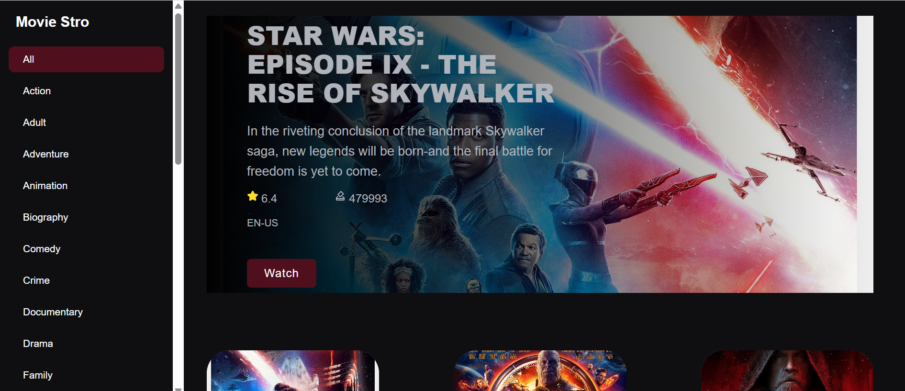

# 🎬 MovieStro

**MovieStro** is a React-based movie discovery app that fetches movie data from the [RapidAPI Movies Database](https://rapidapi.com/). It provides users with a sleek interface to browse, search, and filter movies by genre — with support for pagination.

---

## 🚀 Features

- 🔍 **Search Movies** by title
- 🎭 **Filter by Genre** (Action, Comedy, Thriller, etc.)
- 📄 **Pagination** to browse through movie results
- ⚡ **Fast and dynamic UI** built with React
- 🌐 **Data powered by RapidAPI**

---

## 🛠️ Tech Stack

- **React** (with Hooks and functional components)
- **Axios** for API requests
- **RapidAPI Movies API**

---

## 📦 Installation

1. **Clone the repository**
   ```bash
   git clone https://github.com/yourusername/moviestro.git
   cd moviestro

Hosted Link : https://princoo.github.io/Weekely-Labs/lab-5/movie-explore-app/
Rapid Api (Movie Database): https://rapidapi.com/SAdrian/api/moviesdatabase

